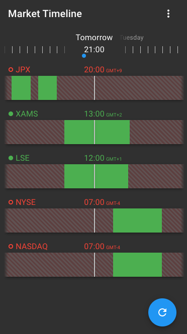

# okato

Okato is the project behind a 'Stock Market Sessions' app providing users a timeline view of the different Stock Exchanges' trading sessions.

You can check a functional deployment at [beta.markettimeline.app](https://beta.markettimeline.app).

## Overview

The webapp allows scrolling through the timelines to check the sessions in the near future and past (7 days span centrered on the current time), this for serveral exchanges at a time. The sessions takes into account the trading hours of the exchanges, the timezones and the local holidays.

## Structure

The application is composed of two modules, for the backend and frontend:

### okato-server

[github.com/aurelticot/okato-server](https://github.com/aurelticot/okato-server)

NodeJS server exposing a GraphQL API.

### okato-client

[github.com/aurelticot/okato-client](https://github.com/aurelticot/okato-client)

React web application

